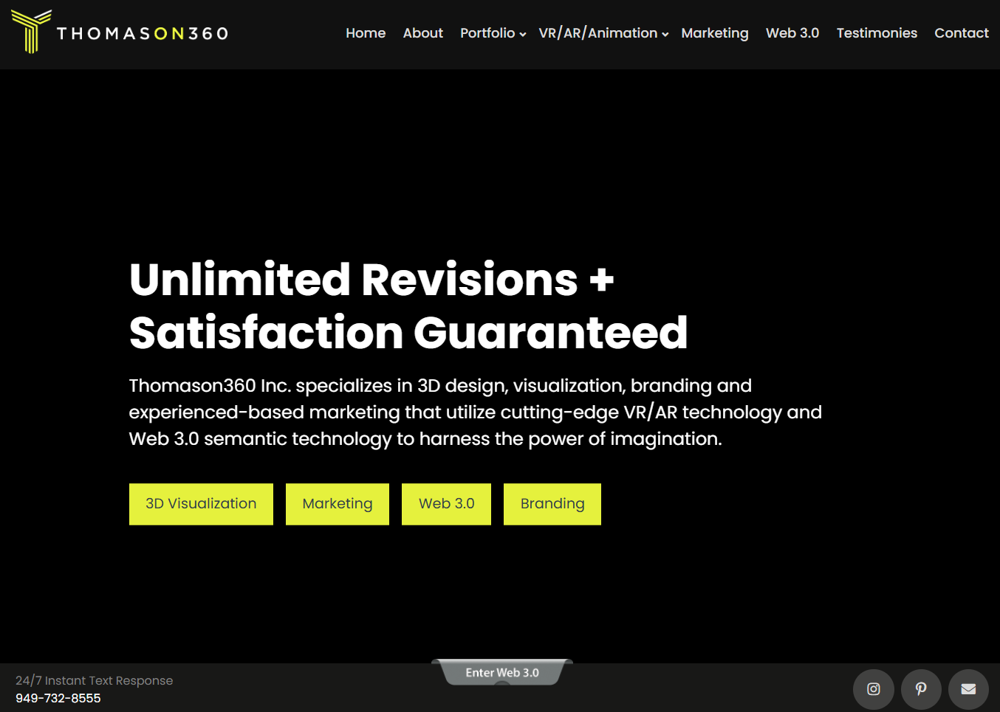
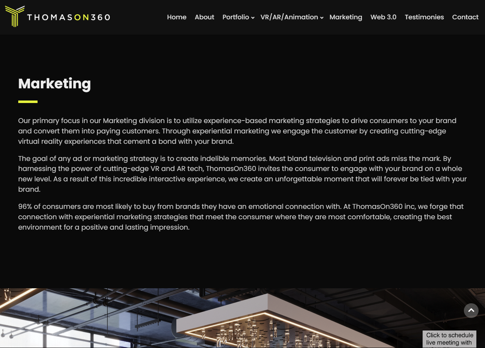
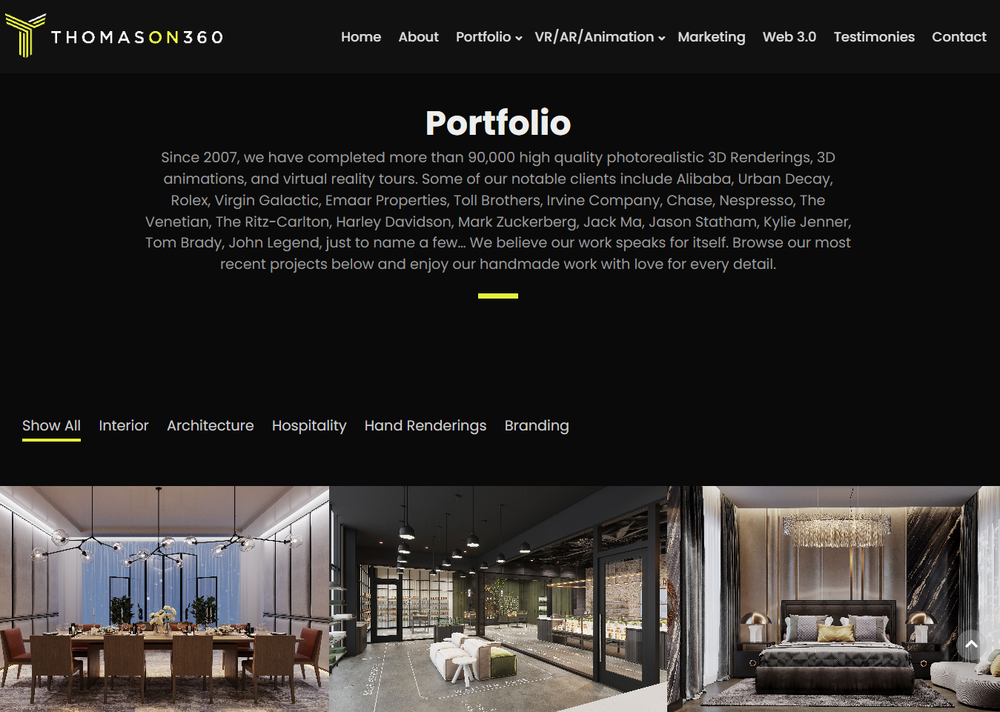

# Thomason360 Website

Thomason360 Inc. specializes in 3D design, visualization, branding and experienced-based marketing that utilize cutting-edge VR/AR technology and Web 3.0 semantic technology to harness the power of imagination.

## Table of Contents

- [Features](#features)
- [Technologies Used](#technologies-used)
- [Installation](#installation)
- [Usage](#usage)
- [UI Previews](#ui-previews)
- [Contributing](#contributing)
- [License](#license)
- [Contact](#contact)

## Features

- **Interactive VR/AR environments:** Engage with various virtual and augmented reality scenes.
- **Cross-platform support:** Designed to work across different browsers and devices.
- **User-friendly interface:** Easy navigation and interaction with VR/AR content.
- **Customization:** Easily modify and extend functionality to suit your needs.

## Technologies Used

- HTML5
- CSS3
- JavaScript
- A-Frame (for VR/AR rendering)

## Installation

To set up the project locally, follow these steps:

1. **Clone the repository:**

   ```bash
   git clone https://github.com/softdev629/serpia-ui.git
   ```

2. **Navigate to the project directory:**

   ```bash
   cd serpia-ui
   ```

3. **Open `index.html` in your preferred web browser to view the site:**

   ```bash
   open index.html
   ```

## Usage

Once you have the website up and running, you can explore various scenes and features. Use your mouse or compatible VR/AR headset to interact with the experiences. For additional controls and settings, refer to the on-screen instructions provided within the website.

## UI Previews

Below are some screenshots of the user interface of our VR/AR website for you to preview.



*Homepage with a welcoming VR demonstration.*



*Marketing page which shows marketing strategy.*



*View of one of the interactive VR scenes available on the website.*

## Contributing

Contributions are welcome! Please follow these steps to contribute:

1. Fork the project.
2. Create your feature branch (`git checkout -b feature/YourFeature`).
3. Commit your changes (`git commit -m 'Add some feature'`).
4. Push to the branch (`git push origin feature/YourFeature`).
5. Open a pull request.

Please ensure your code adheres to the existing style and includes relevant documentation and tests.

## License

This project is licensed under the [MIT License](LICENSE). Feel free to use and modify the code.

## Contact

For questions or feedback, please contact Bohdan at vuongtpv@gmail.com.

---

Thank you for visiting our VR/AR Website project! We hope you enjoy exploring the virtual and augmented worlds we've created.